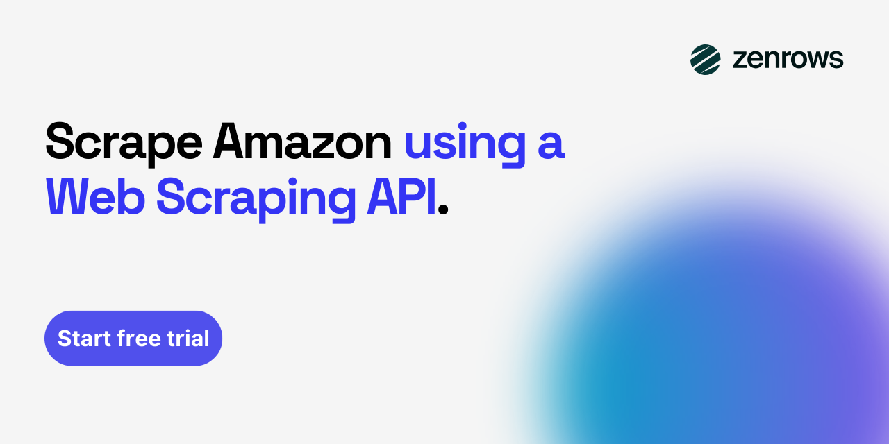

# Amazon Scraper

[](https://app.zenrows.com/register?utm_campaign=262355133-GitHub&utm_source=github&utm_medium=social&utm_content=amazon-scraper)

Extract product data, prices, reviews, and more from [Amazon](https://www.zenrows.com/products/scraper-api/ecommerce/amazon?utm_campaign=262355133-GitHub&utm_source=github&utm_medium=social&utm_content=amazon-scraper). This repository provides both open-source scripts and a ZenRows-powered approach that handles CAPTCHAs and anti-bot bypass automatically.

<p align="center">
  <a href="https://app.zenrows.com/register?utm_campaign=262355133-GitHub&utm_source=github&utm_medium=social&utm_content=amazon-scraper">
    
  </a>
</p>

---

## Table of Contents

- [Amazon Scraper](#amazon-scraper)
  - [Table of Contents](#table-of-contents)
  - [What Amazon Data Can You Extract?](#what-amazon-data-can-you-extract)
    - [Sample Output](#sample-output)
  - [Option 1: Open-Source Amazon Scraper](#option-1-open-source-amazon-scraper)
    - [Prerequisites](#prerequisites)
    - [Usage](#usage)
  - [Option 2: Scraping Amazon with ZenRows](#option-2-scraping-amazon-with-zenrows)
    - [Getting Your API Key](#getting-your-api-key)
    - [Code Examples](#code-examples)
    - [Available Parameters](#available-parameters)
  - [Why Choose ZenRows?](#why-choose-zenrows)
  - [Get Started for Free](#get-started-for-free)
  - [Related Resources](#related-resources)
  - [Support \& Contact](#support--contact)

---

## What Amazon Data Can You Extract?

The scraper extracts key product information from Amazon listings. The data points below are included for demonstration purposes. You can customize the scripts to capture additional pages or fields as needed.

| Field | Description |
|-------|-------------|
| `title` | Product title/name |
| `price` | Current listed price |
| `avg_rating` | Average star rating (1-5) |
| `review_count` | Total number of customer reviews |
| `availability` | Stock availability status |
| `out_of_stock` | Boolean indicating if product is unavailable |
| `category` | Product category breadcrumb |
| `description` | Full product description |
| `features` | Bullet-point feature list |
| `images` | Array of product image URLs |
| `ships_from` | Shipping origin location |
| `sold_by` | Seller name |

### Sample Output

Here's an example of the extracted data:

```json
{
  "title": "Logitech MX Master 3S - Wireless Performance Mouse",
  "price": "$99.99",
  "avg_rating": "4.6",
  "review_count": "12847",
  "availability": "In Stock",
  "out_of_stock": false,
  "category": "Electronics > Computers & Accessories > Computer Accessories > Mice",
  "description": "Logitech MX Master 3S features a redesigned scroll wheel with MagSpeed electromagnetic scrolling, allowing you to scroll through 1,000 lines per second with precision.",
  "features": [
    "8K DPI optical sensor for precise tracking",
    "Quiet Clicks with 90% noise reduction",
    "MagSpeed electromagnetic scrolling",
    "USB-C quick charging - 3 hours on 1 minute charge",
    "Connect up to 3 devices via Bluetooth or USB receiver"
  ],
  "images": [
    "https://m.media-amazon.com/images/I/61ni3t1ryQL._AC_SL1500_.jpg",
    "https://m.media-amazon.com/images/I/71CpBFQLWfL._AC_SL1500_.jpg"
  ],
  "ships_from": "Amazon.com",
  "sold_by": "Amazon.com",
  "url": "https://www.amazon.com/dp/B0FB21526X"
}
```

---

## Option 1: Open-Source Amazon Scraper

The open-source scripts use Python or Node.js to scrape Amazon product pages. This is a good starting point for learning and small-scale projects, though you may encounter blocks when scraping at larger volumes.

### Prerequisites

- Python 3.8+ or Node.js 18+
- pip or npm package manager

### Usage

Example scripts are located in the `/examples/` directory:

**Python:**

| File | Library |
|------|---------|
| `examples/opensource-python/amazon_scraper_requests_beautifulsoup.py` | Requests + BeautifulSoup |
| `examples/opensource-python/amazon_scraper_playwright.py` | Playwright |

**Node.js:**

| File | Library |
|------|---------|
| `examples/opensource-nodejs/amazon_scraper_axios_cheerio.js` | Axios + Cheerio |
| `examples/opensource-nodejs/amazon_scraper_puppeteer.js` | Puppeteer |

Run a Python example:

```bash
pip install requests beautifulsoup4 lxml
python examples/opensource-python/amazon_scraper_requests_beautifulsoup.py
```

Run a Node.js example:

```bash
npm install axios cheerio
node examples/opensource-nodejs/amazon_scraper_axios_cheerio.js
```

<details>
<summary><strong>View Python (Requests + BeautifulSoup) Code</strong></summary>

```python
"""
amazon scraper - open source implementation
scrape amazon product data using Requests and BeautifulSoup.
extracts: availability, avg_rating, category, description, out_of_stock, price, review_count, ships_from, sold_by, title, features, images
requirements:
    pip install requests beautifulsoup4 lxml
"""

import json
import re
import sys
from typing import Optional

import requests
from bs4 import BeautifulSoup

# configuration
TARGET_URL = "https://www.amazon.com/Logitech-Master-Bluetooth-Wireless-Receiver/dp/B0FB21526X"

# realistic browser headers to mimic a real user request
HEADERS = {
    "User-Agent": "Mozilla/5.0 (Windows NT 10.0; Win64; x64) AppleWebKit/537.36 (KHTML, like Gecko) Chrome/131.0.0.0 Safari/537.36",
    "Accept": "text/html,application/xhtml+xml,application/xml;q=0.9,image/avif,image/webp,image/apng,*/*;q=0.8",
    "Accept-Language": "en-US,en;q=0.9",
    "Accept-Encoding": "gzip, deflate, br",
    "Connection": "keep-alive",
    "Upgrade-Insecure-Requests": "1",
}

# css selectors for data extraction (update these based on current amazon html structure)
SELECTORS = {
    "title": "#productTitle",
    "price": "span.a-price span.a-offscreen",
    "avg_rating": "span.a-icon-alt",
    "review_count": "#acrCustomerReviewText",
    "availability": "#availability span",
    "description": "#productDescription p",
    "features": "#feature-bullets ul li span.a-list-item",
    "images": "#imgTagWrapperId img",
    "category": "#wayfinding-breadcrumbs_feature_div ul li a",
    "ships_from": "#tabular-buybox-truncate-0 span.tabular-buybox-text",
    "sold_by": "#tabular-buybox-truncate-1 span.tabular-buybox-text",
}


def fetch_page(url: str) -> Optional[BeautifulSoup]:
    """fetch the page content and return a beautifulsoup object"""
    try:
        # send get request with browser-like headers
        response = requests.get(url, headers=HEADERS, timeout=30)
        response.raise_for_status()

        # parse html content with lxml parser for better performance
        soup = BeautifulSoup(response.content, "lxml")
        return soup

    except requests.exceptions.Timeout:
        print("error: request timed out", file=sys.stderr)
        return None
    except requests.exceptions.ConnectionError:
        print("error: failed to connect to the server", file=sys.stderr)
        return None
    except requests.exceptions.HTTPError as e:
        print(f"error: http error occurred - {e}", file=sys.stderr)
        return None
    except requests.exceptions.RequestException as e:
        print(f"error: request failed - {e}", file=sys.stderr)
        return None


def extract_title(soup: BeautifulSoup) -> Optional[str]:
    """extract the product title"""
    element = soup.select_one(SELECTORS["title"])
    if element:
        return element.get_text(strip=True)
    return None


def extract_price(soup: BeautifulSoup) -> Optional[str]:
    """extract the product price"""
    element = soup.select_one(SELECTORS["price"])
    if element:
        return element.get_text(strip=True)
    return None


def extract_avg_rating(soup: BeautifulSoup) -> Optional[str]:
    """extract the average rating"""
    element = soup.select_one(SELECTORS["avg_rating"])
    if element:
        # extract rating value from text like "4.5 out of 5 stars"
        rating_text = element.get_text(strip=True)
        match = re.search(r"(\d+\.?\d*)\s*out of", rating_text)
        if match:
            return match.group(1)
    return None


def extract_review_count(soup: BeautifulSoup) -> Optional[str]:
    """extract the number of reviews"""
    element = soup.select_one(SELECTORS["review_count"])
    if element:
        # extract number from text like "1,234 ratings"
        review_text = element.get_text(strip=True)
        match = re.search(r"([\d,]+)", review_text)
        if match:
            return match.group(1).replace(",", "")
    return None


def extract_availability(soup: BeautifulSoup) -> Optional[str]:
    """extract product availability status"""
    element = soup.select_one(SELECTORS["availability"])
    if element:
        return element.get_text(strip=True)
    return None


def extract_out_of_stock(soup: BeautifulSoup) -> bool:
    """determine if the product is out of stock"""
    availability = extract_availability(soup)
    if availability:
        # check for common out of stock indicators
        out_of_stock_keywords = ["out of stock", "unavailable", "currently unavailable"]
        return any(keyword in availability.lower() for keyword in out_of_stock_keywords)
    return False


def extract_description(soup: BeautifulSoup) -> Optional[str]:
    """extract the product description"""
    element = soup.select_one(SELECTORS["description"])
    if element:
        return element.get_text(strip=True)
    return None


def extract_features(soup: BeautifulSoup) -> list[str]:
    """extract the product feature bullet points"""
    elements = soup.select(SELECTORS["features"])
    features = []
    for element in elements:
        text = element.get_text(strip=True)
        # filter out empty strings and very short text
        if text and len(text) > 5:
            features.append(text)
    return features


def extract_images(soup: BeautifulSoup) -> list[str]:
    """extract product image urls"""
    images = []
    # try main product image first
    main_img = soup.select_one(SELECTORS["images"])
    if main_img:
        # get the high-res image url from data attributes or src
        img_url = main_img.get("data-old-hires") or main_img.get("src")
        if img_url and img_url.startswith("http"):
            images.append(img_url)

    # try to find additional images in the thumbnail strip
    thumbnail_elements = soup.select("#altImages img.a-dynamic-image")
    for thumb in thumbnail_elements:
        img_url = thumb.get("src")
        if img_url and img_url.startswith("http"):
            # convert thumbnail url to larger image url
            large_url = re.sub(r"\._[A-Z]+\d+_\.", "._AC_SL1500_.", img_url)
            if large_url not in images:
                images.append(large_url)

    return images


def extract_category(soup: BeautifulSoup) -> Optional[str]:
    """extract the product category breadcrumb"""
    elements = soup.select(SELECTORS["category"])
    if elements:
        # build category path from breadcrumbs
        categories = [el.get_text(strip=True) for el in elements]
        return " > ".join(categories)
    return None


def extract_ships_from(soup: BeautifulSoup) -> Optional[str]:
    """extract the ships from information"""
    element = soup.select_one(SELECTORS["ships_from"])
    if element:
        return element.get_text(strip=True)
    return None


def extract_sold_by(soup: BeautifulSoup) -> Optional[str]:
    """extract the sold by information"""
    element = soup.select_one(SELECTORS["sold_by"])
    if element:
        return element.get_text(strip=True)
    return None


def scrape_amazon_product(url: str) -> Optional[dict]:
    """main function to scrape all product data from an amazon url"""
    # fetch the page content
    soup = fetch_page(url)
    if not soup:
        return None

    # extract all data points
    product_data = {
        "title": extract_title(soup),
        "price": extract_price(soup),
        "avg_rating": extract_avg_rating(soup),
        "review_count": extract_review_count(soup),
        "availability": extract_availability(soup),
        "out_of_stock": extract_out_of_stock(soup),
        "description": extract_description(soup),
        "features": extract_features(soup),
        "images": extract_images(soup),
        "category": extract_category(soup),
        "ships_from": extract_ships_from(soup),
        "sold_by": extract_sold_by(soup),
        "url": url,
    }

    return product_data


def main():
    """main execution entry point"""
    print(f"scraping: {TARGET_URL}\n")

    # scrape the product data
    product_data = scrape_amazon_product(TARGET_URL)

    if product_data:
        # output as formatted json
        print(json.dumps(product_data, indent=2, ensure_ascii=False))
    else:
        print("failed to scrape product data", file=sys.stderr)
        sys.exit(1)


if __name__ == "__main__":
    main()
```

</details>

> ⚠️ **Note:** Plain open-source scrapers may get blocked by Amazon's anti-bot systems. For reliable, production-scale scraping, see the [ZenRows approach](#scraping-amazon-with-zenrows) below.

---

## Option 2: Scraping Amazon with ZenRows

ZenRows removes the friction from Amazon scraping. It automatically bypasses anti-bot systems and CAPTCHAs, rotates through millions of residential proxies, renders JavaScript content, and handles geo-targeting across 185+ countries.

The API handles the complexity so you can focus on your data.

### Getting Your API Key

1. [Sign up for a free ZenRows account](https://app.zenrows.com/register?utm_campaign=262355133-GitHub&utm_source=github&utm_medium=social&utm_content=amazon-scraper) (no credit card required)
2. Navigate to the [Dashboard](https://app.zenrows.com/builder?utm_campaign=262355133-GitHub&utm_source=github&utm_medium=social&utm_content=amazon-scraper) to find your API key
3. Get 1,000 free requests to start scraping immediately

### Code Examples

Working examples are available in multiple languages:

| File | Language |
|------|----------|
| `examples/zenrows/python/scraper.py` | Python |
| `examples/zenrows/nodejs/scraper.js` | Node.js |
| `examples/zenrows/ruby/scraper.rb` | Ruby |
| `examples/zenrows/go/scraper.go` | Go |
| `examples/zenrows/java/Scraper.java` | Java |
| `examples/zenrows/php/scraper.php` | PHP |
| `examples/zenrows/csharp/Scraper.cs` | C# |

<details>
<summary><strong>View Python (ZenRows) Code</strong></summary>

```python
"""
amazon scraper - zenrows implementation
scrape amazon product data using the ZenRows' Universal Scraper API.
requirements:
    pip install requests
"""

import requests

url = "https://www.amazon.com/Logitech-Master-Bluetooth-Wireless-Receiver/dp/B0FB21526X"
apikey = "<YOUR_ZENROWS_API_KEY>"
params = {
    "url": url,
    "apikey": apikey,
    "js_render": "true",
    "premium_proxy": "true",
    "autoparse": "true",
}
response = requests.get("https://api.zenrows.com/v1/", params=params)
print(response.text)

```

</details>

Each example demonstrates how to:
- Extract product data from any Amazon URL
- Handle JavaScript-rendered content
- Use Premium Proxies to bypass anti-bot protection

### Available Parameters

Fine-tune your requests with ZenRows parameters. For the complete list and detailed usage, see the [ZenRows API Documentation](https://docs.zenrows.com/universal-scraper-api/api-reference?utm_campaign=262355133-GitHub&utm_source=github&utm_medium=social&utm_content=amazon-scraper).

| Parameter | Type | Description |
|-----------|------|-------------|
| `js_render` | boolean | Enable headless browser for JS-heavy pages |
| `premium_proxy` | boolean | Use Premium Proxies for better success rates |
| `wait` | integer | Wait time (ms) for dynamic content to load |
| `wait_for` | string | CSS selector to wait for before returning |
| `block_resources` | string | Block images/CSS/fonts for faster requests |

---

## Why Choose ZenRows?

| Challenge | ZenRows Solution |
|-----------|------------------|
| ❌ CAPTCHAs blocking requests | ✅ Automatic CAPTCHA bypass |
| ❌ IP bans and rate limiting | ✅ 55M+ rotating residential proxies |
| ❌ JavaScript-heavy pages | ✅ Headless browser rendering |
| ❌ Anti-bot detection | ✅ Automatic anti-bot bypass |
| ❌ Geo-restricted content | ✅ Geo-targeting from 185+ countries |
| ❌ Complex proxy infrastructure | ✅ Simple API, no servers needed |
| ❌ Maintaining scraper code | ✅ ZenRows handles site changes |

**One API call. Any Amazon page. Zero blocks.**

## Get Started for Free

Start with 1,000 free requests:

<p align="center">
  <a href="https://app.zenrows.com/register?utm_campaign=262355133-GitHub&utm_source=github&utm_medium=social&utm_content=amazon-scraper">
    
  </a>
</p>

✅ 1,000 free requests to test any Amazon page  
✅ Full access to all features including anti-bot bypass  
✅ No credit card required  

## Related Resources

**Documentation:**

- [ZenRows API Reference](https://docs.zenrows.com/universal-scraper-api/api-reference?utm_campaign=262355133-GitHub&utm_source=github&utm_medium=social&utm_content=amazon-scraper) - Complete API documentation
- [Get Started](https://docs.zenrows.com/universal-scraper-api/first-request) - Make your first request with ZenRows' Universal Scraper API

**Blog Tutorials:**

- [How to Scrape Amazon With Python: Step-by-Step Tutorial](https://www.zenrows.com/blog/web-scraping-amazon?utm_campaign=262355133-GitHub&utm_source=github&utm_medium=social&utm_content=amazon-scraper)
- [How to Scrape Amazon Reviews in 2026](https://www.zenrows.com/blog/scrape-amazon-reviews?utm_campaign=262355133-GitHub&utm_source=github&utm_medium=social&utm_content=amazon-scraper) 
- [How to Bypass Amazon CAPTCHA When Web Scraping](https://www.zenrows.com/blog/amazon-captcha-bypass?utm_campaign=262355133-GitHub&utm_source=github&utm_medium=social&utm_content=amazon-scraper)
- [How to Scrape Amazon With Selenium: Step-by-Step Tutorial](https://www.zenrows.com/blog/scraping-amazon-selenium?utm_campaign=262355133-GitHub&utm_source=github&utm_medium=social&utm_content=amazon-scraper)

## Support & Contact

- 📖 [Documentation](https://docs.zenrows.com?utm_campaign=262355133-GitHub&utm_source=github&utm_medium=social&utm_content=amazon-scraper) - Full API reference and guides
- 🛠️ [Request Builder](https://app.zenrows.com/builder?utm_campaign=262355133-GitHub&utm_source=github&utm_medium=social&utm_content=amazon-scraper) - Try ZenRows' playground
- 💬 [Contact Us](https://www.zenrows.com/contact?utm_campaign=262355133-GitHub&utm_source=github&utm_medium=social&utm_content=amazon-scraper) - Get in touch
- 📧 [Email Support](mailto:support@zenrows.com) - Get help from the ZenRows team